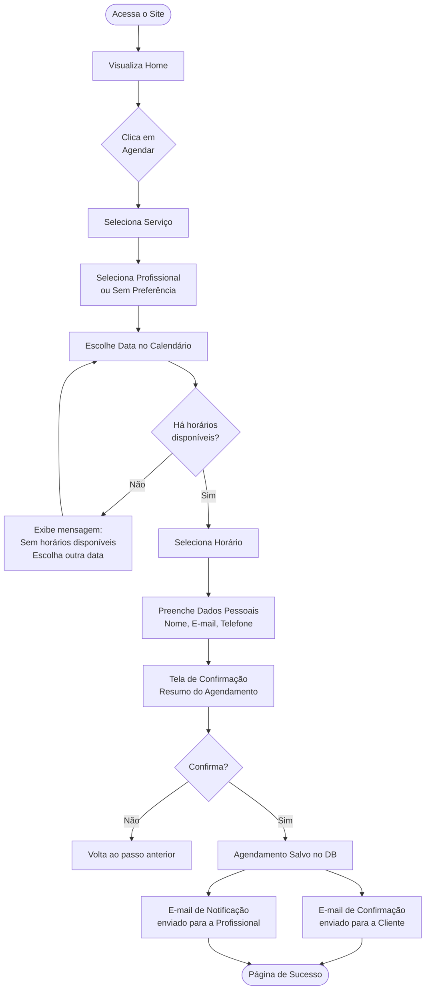
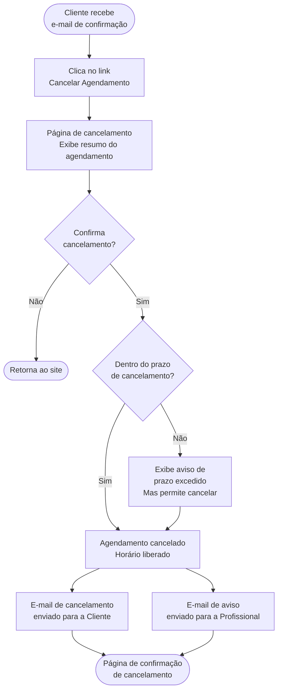
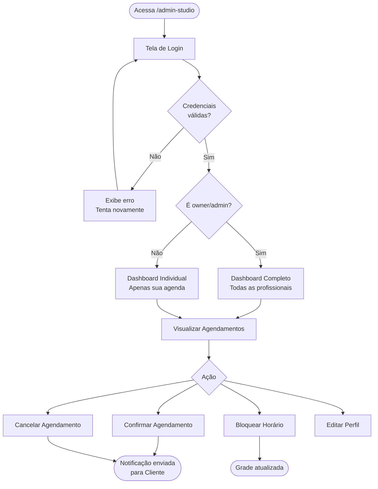
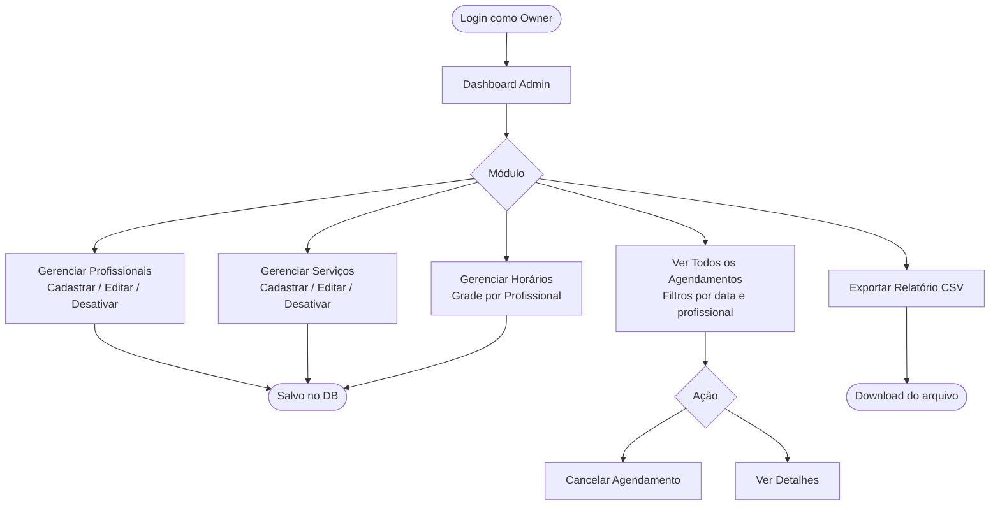
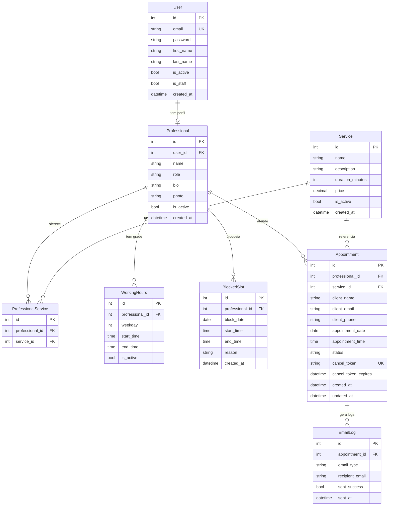

# PRD — Espaço Delas · Sistema Web de Agendamento

> **Versão:** 1.0  
> **Data:** Maio 2026  
> **Status:** Em elaboração  
> **Responsável:** Product Owner

---

## Sumário

1. [Visão Geral](#1-visão-geral)
2. [Sobre o Produto](#2-sobre-o-produto)
3. [Propósito](#3-propósito)
4. [Público-Alvo](#4-público-alvo)
5. [Objetivos](#5-objetivos)
6. [Requisitos Funcionais](#6-requisitos-funcionais)
7. [Flowchart de UX](#7-flowchart-de-ux)
8. [Requisitos Não-Funcionais](#8-requisitos-não-funcionais)
9. [Arquitetura Técnica](#9-arquitetura-técnica)
10. [Stack](#10-stack)
11. [Estrutura de Dados](#11-estrutura-de-dados)
12. [Design System](#12-design-system)
13. [User Stories](#13-user-stories)
14. [Critérios de Aceite](#14-critérios-de-aceite)
15. [Métricas de Sucesso e KPIs](#15-métricas-de-sucesso-e-kpis)
16. [Riscos e Mitigações](#16-riscos-e-mitigações)
17. [Lista de Tarefas por Sprint](#17-lista-de-tarefas-por-sprint)

---

## 1. Visão Geral

O **Espaço Delas** é um studio de beleza feminino especializado em manicure e design de sobrancelhas, com três profissionais fixas. O projeto consiste em desenvolver um **site institucional com sistema de agendamento online**, alinhado à identidade visual da marca — elegante, feminino e sofisticado — permitindo que clientes agendem horários de forma autônoma, sem necessidade de contato via WhatsApp ou ligação.

A solução será construída com **Django** no backend, **Django Template Language (DTL)** no frontend com **TailwindCSS**, seguindo rigorosamente o Design System extraído da identidade visual entregue.

---

## 2. Sobre o Produto

| Atributo | Detalhe |
|---|---|
| **Nome** | Espaço Delas |
| **Segmento** | Beleza & Estética |
| **Serviços** | Manicure e Design de Sobrancelhas |
| **Profissionais** | Alessandra (Manicure), Luana (Manicure), Larissa (Design de Sobrancelhas) |
| **Canal** | Web (responsivo — mobile-first) |
| **Plataforma** | Django + TailwindCSS |

---

## 3. Propósito

Oferecer ao Espaço Delas uma **presença digital profissional** que:

- Reflita a identidade visual e o posicionamento premium da marca;
- Automatize o processo de agendamento, reduzindo o trabalho operacional das profissionais;
- Ofereça às clientes uma experiência de marcação de horários clara, rápida e agradável;
- Centralize a gestão de agenda das três profissionais em um único painel administrativo.

---

## 4. Público-Alvo

### Clientes (Usuárias Finais)

- Mulheres entre 18 e 50 anos;
- Residentes na região do studio;
- Familiarizadas com smartphones e uso de apps/sites para marcação de serviços;
- Valorizam praticidade, estética e atendimento personalizado.

### Administradoras (Profissionais do Studio)

- Alessandra, Luana e Larissa — as três profissionais;
- Necessitam visualizar e gerenciar sua própria agenda;
- Podem ter variação de familiaridade com tecnologia (interface deve ser simples e intuitiva).

---

## 5. Objetivos

### Objetivos de Negócio

- Eliminar a dependência de WhatsApp/ligação para agendamentos;
- Reduzir no-shows com confirmações e lembretes automáticos por e-mail;
- Aumentar a taxa de retorno de clientes com lembretes de reagendamento;
- Fortalecer a presença digital da marca.

### Objetivos de Produto

- Disponibilizar um fluxo de agendamento em menos de 3 cliques/etapas;
- Garantir que cada profissional visualize apenas sua própria agenda;
- Permitir que a administradora (owner) visualize a agenda completa;
- Enviar confirmação automática de agendamento por e-mail;
- Garantir que o site carregue em menos de 2 segundos em conexão 4G.

---

## 6. Requisitos Funcionais

### RF-01 · Página Institucional (Home)

- Exibir logo, nome e slogan do Espaço Delas;
- Apresentar seção "Sobre o Studio";
- Listar os serviços oferecidos com descrição e preço (opcional);
- Apresentar as profissionais com foto, nome e especialidade;
- Exibir galeria de trabalhos (fotos);
- Exibir depoimentos de clientes;
- Apresentar botão de CTA (Call to Action) para agendamento em destaque;
- Exibir informações de contato, endereço e redes sociais;
- Integrar mapa (Google Maps embed).

### RF-02 · Sistema de Agendamento (Fluxo da Cliente)

- Permitir que a cliente escolha o **serviço** desejado;
- Permitir que a cliente escolha a **profissional** (ou "sem preferência");
- Exibir calendário com os **dias disponíveis** para a profissional/serviço selecionado;
- Exibir os **horários disponíveis** do dia selecionado;
- Coletar dados da cliente: nome completo, e-mail, telefone (WhatsApp);
- Exibir **tela de confirmação** com resumo do agendamento antes de finalizar;
- Enviar **e-mail de confirmação** para a cliente após o agendamento;
- Enviar **e-mail de notificação** para a profissional quando um novo agendamento for feito;
- Exibir **página de sucesso** após confirmação.

### RF-03 · Painel Administrativo — Profissional

- Login com e-mail e senha;
- Visualizar agenda do dia/semana/mês;
- Visualizar detalhes de cada agendamento (cliente, serviço, horário);
- Confirmar ou cancelar um agendamento;
- Bloquear horários (férias, folgas, indisponibilidade);
- Editar dados de perfil (nome, foto, bio).

### RF-04 · Painel Administrativo — Owner/Admin

- Acesso total à agenda das três profissionais;
- Cadastrar, editar e desativar profissionais;
- Cadastrar, editar e desativar serviços;
- Definir horários de funcionamento e intervalos por profissional;
- Visualizar histórico de agendamentos;
- Cancelar qualquer agendamento;
- Exportar relatório de agendamentos (CSV).

### RF-05 · Gestão de Disponibilidade

- Cada profissional tem grade de horários configurável (dias e horas de atendimento);
- Horários já agendados são automaticamente removidos da disponibilidade;
- Horários bloqueados manualmente também são removidos;
- Duração do atendimento é configurável por serviço.

### RF-06 · Cancelamento pela Cliente

- A cliente pode cancelar seu agendamento via link enviado no e-mail de confirmação;
- Cancelamentos com menos de X horas de antecedência exibem aviso (configurável);
- Após cancelamento, o horário volta a ficar disponível automaticamente.

### RF-07 · Notificações e Lembretes

- Envio de e-mail de lembrete 24h antes do agendamento (tarefa agendada via Celery);
- Envio de e-mail de confirmação imediatamente após o agendamento;
- Envio de e-mail de cancelamento quando um agendamento for cancelado.

---

## 7. Flowchart de UX

### 7.1 · Fluxo da Cliente — Agendamento



### 7.2 · Fluxo de Cancelamento pela Cliente



### 7.3 · Fluxo da Profissional — Painel



### 7.4 · Fluxo do Admin — Gestão Completa



---

## 8. Requisitos Não-Funcionais

| ID | Categoria | Requisito |
|---|---|---|
| RNF-01 | Performance | Tempo de carregamento da Home < 2s em 4G |
| RNF-02 | Performance | Tempo de resposta das APIs internas < 300ms |
| RNF-03 | Responsividade | Layout funcional em mobile (320px), tablet (768px) e desktop (1280px+) |
| RNF-04 | Acessibilidade | Conformidade com WCAG 2.1 nível AA |
| RNF-05 | Segurança | Senhas armazenadas com hashing (bcrypt via Django) |
| RNF-06 | Segurança | Proteção contra CSRF em todos os formulários |
| RNF-07 | Segurança | Rate limiting nas rotas de agendamento e login |
| RNF-08 | Segurança | Links de cancelamento com token UUID expiráveis |
| RNF-09 | SEO | Meta tags, Open Graph e sitemap.xml configurados |
| RNF-10 | Manutenibilidade | Cobertura de testes unitários ≥ 80% nas views e models |
| RNF-11 | Disponibilidade | Uptime de 99,5% (SLA de hospedagem) |
| RNF-12 | Escalabilidade | Estrutura preparada para adicionar novas profissionais sem refatoração |
| RNF-13 | UX | Fluxo de agendamento concluível em no máximo 4 etapas |
| RNF-14 | E-mail | Envio de e-mails transacionais via SMTP ou API (SendGrid/Mailgun) |

---

## 9. Arquitetura Técnica

```
┌─────────────────────────────────────────────────────────┐
│                      CLIENTE (Browser)                   │
│           Django Templates + TailwindCSS                 │
└────────────────────────┬────────────────────────────────┘
                         │ HTTP/HTTPS
┌────────────────────────▼────────────────────────────────┐
│                    NGINX (Reverse Proxy)                  │
│                  Servir arquivos estáticos                │
└────────────────────────┬────────────────────────────────┘
                         │
┌────────────────────────▼────────────────────────────────┐
│              DJANGO APPLICATION SERVER (Gunicorn)         │
│                                                          │
│  ┌─────────────┐  ┌──────────────┐  ┌────────────────┐  │
│  │  App: core  │  │ App: booking │  │  App: accounts │  │
│  │  (home/cms) │  │  (agendamento│  │  (auth/perfis) │  │
│  └─────────────┘  └──────────────┘  └────────────────┘  │
│                                                          │
│  ┌─────────────────────────────────────────────────────┐ │
│  │              Django ORM / Models                     │ │
│  └─────────────────────────────────────────────────────┘ │
└────────────┬──────────────────────────────┬─────────────┘
             │                              │
┌────────────▼──────────┐    ┌─────────────▼─────────────┐
│   PostgreSQL Database  │    │  Celery + Redis            │
│   (dados principais)   │    │  (tarefas assíncronas:     │
└────────────────────────┘    │   e-mails, lembretes)      │
                              └────────────────────────────┘
                                            │
                              ┌─────────────▼─────────────┐
                              │  SMTP / SendGrid / Mailgun  │
                              │  (envio de e-mails)         │
                              └────────────────────────────┘
```

---

## 10. Stack

| Camada | Tecnologia | Versão Recomendada |
|---|---|---|
| **Backend** | Python | 3.12+ |
| **Framework Web** | Django | 5.x |
| **Frontend** | Django Template Language + TailwindCSS | Tailwind 3.x |
| **Banco de Dados** | PostgreSQL | 16+ |
| **Cache / Broker** | Redis | 7+ |
| **Tarefas Assíncronas** | Celery | 5.x |
| **Servidor de Aplicação** | Gunicorn | latest |
| **Proxy Reverso** | Nginx | latest |
| **E-mail Transacional** | SendGrid ou Mailgun | — |
| **Armazenamento de Mídia** | AWS S3 ou Cloudflare R2 | — |
| **Versionamento** | Git + GitHub | — |
| **Deploy** | Railway, Render ou VPS (Ubuntu) | — |
| **CI/CD** | GitHub Actions | — |
| **Testes** | pytest-django | latest |

---

## 11. Estrutura de Dados

### Schema do Banco de Dados



---

## 12. Design System

O Design System do Espaço Delas é derivado diretamente da identidade visual fornecida. Toda a implementação utiliza **TailwindCSS dentro do Django Template Language**.

---

### 12.1 · Paleta de Cores

| Token | Hex | Uso |
|---|---|---|
| `primary` | `#C97B8A` (Rose médio — extraído do logo) | CTAs, destaques, links ativos |
| `primary-light` | `#E8A4B2` (Rose claro) | Hover states, backgrounds suaves |
| `primary-dark` | `#A05565` (Rose escuro) | Active states, bordas de foco |
| `neutral-dark` | `#333333` | Textos principais, títulos |
| `neutral-mid` | `#666666` | Textos secundários, labels |
| `neutral-light` | `#F5F5F5` | Background padrão das páginas |
| `white` | `#FFFFFF` | Cards, modais, inputs |
| `success` | `#5C9E6E` | Confirmações, badges de sucesso |
| `error` | `#C0392B` | Mensagens de erro, alertas |
| `warning` | `#D4A017` | Avisos |

**Configuração no `tailwind.config.js`:**

```js
// tailwind.config.js
module.exports = {
  theme: {
    extend: {
      colors: {
        primary: {
          DEFAULT: '#C97B8A',
          light:   '#E8A4B2',
          dark:    '#A05565',
        },
        neutral: {
          dark:  '#333333',
          mid:   '#666666',
          light: '#F5F5F5',
        },
        success: '#5C9E6E',
        error:   '#C0392B',
        warning: '#D4A017',
      },
    },
  },
}
```

---

### 12.2 · Tipografia

Baseada nas fontes identificadas na identidade visual:

| Papel | Fonte | Uso | Import |
|---|---|---|---|
| **Display / Script** | Nova Quinta | Títulos hero, palavra "Delas" no logo | Google Fonts ou arquivo local |
| **Serif / Heading** | Against (similar: Cormorant Garamond) | Títulos de seção, headings H1–H3 | Google Fonts |
| **Body** | DM Sans ou Jost | Corpo de texto, parágrafos, labels | Google Fonts |

**Classes Tailwind customizadas:**

```html
<!-- Título principal (hero) -->
<h1 class="font-display text-5xl text-neutral-dark leading-tight tracking-tight">
  Espaço <span class="font-script text-primary">Delas</span>
</h1>

<!-- Título de seção -->
<h2 class="font-serif text-3xl text-neutral-dark">Nossos Serviços</h2>

<!-- Texto de corpo -->
<p class="font-sans text-base text-neutral-mid leading-relaxed">...</p>
```

**Configuração no `tailwind.config.js`:**

```js
fontFamily: {
  sans:    ['DM Sans', 'sans-serif'],
  serif:   ['Cormorant Garamond', 'serif'],
  display: ['Cormorant Garamond', 'serif'],
  script:  ['Dancing Script', 'cursive'], // aproximação web da Nova Quinta
},
```

---

### 12.3 · Botões

```html
<!-- Botão primário (CTA principal) -->
<button class="bg-primary hover:bg-primary-dark text-white font-sans font-medium
               px-8 py-3 rounded-full transition-all duration-200
               shadow-sm hover:shadow-md active:scale-95">
  Agendar Agora
</button>

<!-- Botão secundário (outline) -->
<button class="border border-primary text-primary hover:bg-primary hover:text-white
               font-sans font-medium px-8 py-3 rounded-full transition-all duration-200">
  Ver Disponibilidade
</button>

<!-- Botão ghost (links) -->
<button class="text-primary hover:text-primary-dark underline-offset-4 hover:underline
               font-sans text-sm transition-colors duration-150">
  Cancelar agendamento
</button>

<!-- Botão de perigo -->
<button class="bg-error hover:bg-red-700 text-white font-sans font-medium
               px-6 py-2 rounded-full transition-all duration-200">
  Cancelar
</button>
```

---

### 12.4 · Inputs e Formulários

```html
<!-- Input padrão -->
<div class="flex flex-col gap-1">
  <label class="text-sm font-medium text-neutral-dark font-sans">Nome completo</label>
  <input
    type="text"
    class="w-full border border-gray-200 rounded-xl px-4 py-3
           text-neutral-dark placeholder-gray-300 font-sans text-sm
           focus:outline-none focus:ring-2 focus:ring-primary focus:border-transparent
           bg-white transition-all duration-150"
    placeholder="Digite seu nome"
  />
  <!-- Mensagem de erro -->
  <span class="text-xs text-error">Campo obrigatório</span>
</div>

<!-- Select -->
<select class="w-full border border-gray-200 rounded-xl px-4 py-3
               text-neutral-dark font-sans text-sm bg-white
               focus:outline-none focus:ring-2 focus:ring-primary
               appearance-none cursor-pointer">
  <option value="">Selecione um serviço</option>
</select>

<!-- Textarea -->
<textarea
  class="w-full border border-gray-200 rounded-xl px-4 py-3
         text-neutral-dark font-sans text-sm resize-none
         focus:outline-none focus:ring-2 focus:ring-primary"
  rows="3"
></textarea>
```

---

### 12.5 · Cards

```html
<!-- Card de serviço -->
<div class="bg-white rounded-2xl shadow-sm hover:shadow-md transition-shadow
            duration-200 p-6 border border-gray-100">
  <div class="w-10 h-10 bg-primary-light rounded-full flex items-center
              justify-center mb-4">
    <!-- ícone SVG -->
  </div>
  <h3 class="font-serif text-lg text-neutral-dark mb-2">Manicure Clássica</h3>
  <p class="font-sans text-sm text-neutral-mid leading-relaxed">Descrição...</p>
  <p class="font-sans text-primary font-medium mt-4">A partir de R$ 40</p>
</div>

<!-- Card de profissional -->
<div class="bg-white rounded-2xl overflow-hidden shadow-sm hover:shadow-md
            transition-all duration-200 group">
  <div class="aspect-square overflow-hidden">
    
  </div>
  <div class="p-5">
    <h3 class="font-serif text-lg text-neutral-dark">Alessandra</h3>
    <p class="font-sans text-sm text-primary">Manicure</p>
  </div>
</div>
```

---

### 12.6 · Grid e Layout

```html
<!-- Grid de serviços (3 colunas desktop, 1 mobile) -->
<div class="grid grid-cols-1 md:grid-cols-2 lg:grid-cols-3 gap-6">
  <!-- cards -->
</div>

<!-- Grid de profissionais (3 colunas fixas) -->
<div class="grid grid-cols-1 sm:grid-cols-3 gap-8">
  <!-- cards -->
</div>

<!-- Container padrão -->
<div class="max-w-6xl mx-auto px-4 sm:px-6 lg:px-8">
  <!-- conteúdo -->
</div>

<!-- Section padrão -->
<section class="py-16 lg:py-24">
  <!-- conteúdo -->
</section>
```

---

### 12.7 · Navegação (Menu)

```html
<!-- Navbar -->
<nav class="bg-white border-b border-gray-100 sticky top-0 z-50">
  <div class="max-w-6xl mx-auto px-4 sm:px-6 lg:px-8">
    <div class="flex items-center justify-between h-16">
      <!-- Logo -->
      <a href="/" class="flex items-center gap-3">
        
        <span class="font-serif text-xl text-neutral-dark">
          Espaço <span class="text-primary font-script">Delas</span>
        </span>
      </a>

      <!-- Links desktop -->
      <div class="hidden md:flex items-center gap-8">
        <a href="#servicos" class="font-sans text-sm text-neutral-mid
                                   hover:text-primary transition-colors">Serviços</a>
        <a href="#profissionais" class="font-sans text-sm text-neutral-mid
                                        hover:text-primary transition-colors">Profissionais</a>
        <a href="#sobre" class="font-sans text-sm text-neutral-mid
                                hover:text-primary transition-colors">Sobre</a>
        <a href=""
           class="bg-primary hover:bg-primary-dark text-white font-sans text-sm
                  font-medium px-6 py-2 rounded-full transition-all duration-200">
          Agendar
        </a>
      </div>

      <!-- Hamburguer mobile -->
      <button class="md:hidden p-2 text-neutral-dark" id="menu-toggle">
        <!-- ícone hamburguer -->
      </button>
    </div>
  </div>
</nav>
```

---

### 12.8 · Estados de Feedback

```html
<!-- Toast de sucesso -->
<div class="fixed bottom-6 right-6 bg-success text-white px-6 py-4 rounded-2xl
            shadow-lg flex items-center gap-3 font-sans text-sm z-50">
  ✓ Agendamento confirmado!
</div>

<!-- Alert de erro inline -->
<div class="bg-red-50 border border-red-200 text-error rounded-xl px-4 py-3
            font-sans text-sm flex items-center gap-2">
  ⚠ Horário indisponível. Escolha outro horário.
</div>

<!-- Badge de status do agendamento -->
<span class="inline-block bg-primary-light text-primary-dark text-xs font-medium
             px-3 py-1 rounded-full font-sans">Confirmado</span>
<span class="inline-block bg-yellow-100 text-yellow-700 text-xs font-medium
             px-3 py-1 rounded-full font-sans">Pendente</span>
<span class="inline-block bg-red-100 text-error text-xs font-medium
             px-3 py-1 rounded-full font-sans">Cancelado</span>
```

---

## 13. User Stories

### Épico 1 · Agendamento Online

| ID | Como... | Quero... | Para... |
|---|---|---|---|
| US-01 | cliente | visualizar os serviços disponíveis com descrição e duração | entender o que posso agendar |
| US-02 | cliente | escolher a profissional de minha preferência | ter atendimento com quem confio |
| US-03 | cliente | ver somente os horários disponíveis | não tentar agendar um horário ocupado |
| US-04 | cliente | receber confirmação por e-mail | ter um comprovante do meu agendamento |
| US-05 | cliente | cancelar meu agendamento pelo e-mail | desmarcar sem precisar ligar |
| US-06 | cliente | receber lembrete 24h antes | não esquecer meu horário |

### Épico 2 · Painel da Profissional

| ID | Como... | Quero... | Para... |
|---|---|---|---|
| US-07 | profissional | acessar minha agenda do dia | saber meus atendimentos |
| US-08 | profissional | bloquear horários específicos | marcar folgas e intervalos |
| US-09 | profissional | receber e-mail quando novo agendamento for feito | ser notificada rapidamente |
| US-10 | profissional | cancelar um agendamento | reagendar em casos de imprevisto |

### Épico 3 · Administração

| ID | Como... | Quero... | Para... |
|---|---|---|---|
| US-11 | admin | cadastrar novos serviços | expandir o catálogo do studio |
| US-12 | admin | configurar a grade de horários de cada profissional | controlar disponibilidade |
| US-13 | admin | visualizar todos os agendamentos | ter visão geral do negócio |
| US-14 | admin | exportar relatório de agendamentos | análise e controle financeiro |

### Épico 4 · Institucional

| ID | Como... | Quero... | Para... |
|---|---|---|---|
| US-15 | visitante | ver informações do studio na home | decidir se quero agendar |
| US-16 | visitante | ver as profissionais e suas especialidades | escolher com confiança |
| US-17 | visitante | acessar o site pelo celular sem problemas | agendar de onde estiver |

---

## 14. Critérios de Aceite

### CA-01 · Fluxo de Agendamento

- [ ] É possível selecionar serviço, profissional, data e horário em sequência;
- [ ] Horários já ocupados não aparecem na listagem;
- [ ] Horários bloqueados manualmente não aparecem na listagem;
- [ ] A tela de confirmação exibe: serviço, profissional, data, hora e dados da cliente;
- [ ] Após confirmação, o agendamento é salvo com status `pending` ou `confirmed`;
- [ ] E-mail de confirmação é enviado para a cliente em até 1 minuto;
- [ ] E-mail de notificação é enviado para a profissional em até 1 minuto;
- [ ] A página de sucesso exibe resumo e opção de adicionar ao calendário.

### CA-02 · Cancelamento

- [ ] O link de cancelamento no e-mail funciona e exibe os dados do agendamento;
- [ ] Após cancelamento, o agendamento muda para status `cancelled`;
- [ ] O horário volta à disponibilidade automaticamente;
- [ ] Link de cancelamento expira após 24h depois do horário do agendamento;
- [ ] E-mail de cancelamento é enviado para a cliente e para a profissional.

### CA-03 · Painel Admin

- [ ] Login com credenciais corretas redireciona para o dashboard;
- [ ] Login com credenciais incorretas exibe mensagem de erro clara;
- [ ] Profissional só visualiza sua própria agenda;
- [ ] Owner visualiza agenda de todas as profissionais;
- [ ] Bloqueio de horário remove o slot imediatamente da disponibilidade pública;
- [ ] Exportação CSV contém: data, hora, serviço, profissional, cliente, status.

### CA-04 · Responsividade e Performance

- [ ] Site funciona em viewport de 320px (mobile pequeno) sem scroll horizontal;
- [ ] Todos os formulários são usáveis em tela touch;
- [ ] Lighthouse Score ≥ 85 em Performance, Acessibilidade e SEO;
- [ ] Imagens carregam com lazy loading.

---

## 15. Métricas de Sucesso e KPIs

### KPIs de Produto

| Métrica | Meta | Período |
|---|---|---|
| Taxa de conversão do fluxo de agendamento (iniciou → concluiu) | ≥ 70% | Mensal |
| Taxa de abandono por etapa do funil | < 15% por etapa | Mensal |
| Tempo médio para concluir um agendamento | < 3 minutos | Mensal |
| Taxa de erro no formulário (submissões com erros) | < 5% | Mensal |

### KPIs de Usuário

| Métrica | Meta | Período |
|---|---|---|
| Taxa de no-show (comparecimento) | Redução de 30% vs. período sem sistema | Trimestral |
| Taxa de retorno de clientes (reagendamento ≤ 30 dias) | ≥ 50% | Mensal |
| NPS (pesquisa periódica) | ≥ 50 | Trimestral |
| Taxa de cancelamento online | < 20% dos agendamentos feitos | Mensal |

### KPIs de Negócio

| Métrica | Meta | Período |
|---|---|---|
| Redução do tempo gasto com agendamentos manuais (WhatsApp/Ligação) | ≥ 80% | Após 60 dias |
| Total de agendamentos realizados via sistema | Crescimento MoM de 20% | Mensal |
| Taxa de ocupação das profissionais | ≥ 75% dos horários disponíveis | Mensal |
| Receita estimada atribuída ao canal digital | Rastreável via relatório | Mensal |

---

## 16. Riscos e Mitigações

| ID | Risco | Probabilidade | Impacto | Mitigação |
|---|---|---|---|---|
| R-01 | Baixa adoção pelas clientes (preferência por WhatsApp) | Média | Alto | Comunicação nas redes sociais; incentivo ao agendamento online; link direto no bio do Instagram |
| R-02 | Conflito de horários por race condition (dois usuários agendando o mesmo slot simultaneamente) | Baixa | Alto | Transação atômica no banco + lock otimista na view de confirmação |
| R-03 | E-mails caindo em spam | Média | Médio | Configurar SPF, DKIM e DMARC; usar domínio próprio; provider reputado (SendGrid) |
| R-04 | Profissional não atualiza horários de bloqueio | Alta | Médio | Interface de bloqueio simples no painel; notificação push futura |
| R-05 | Perda de dados por falha no servidor | Baixa | Alto | Backups automáticos diários do PostgreSQL; deploy em provedor com redundância |
| R-06 | Escalabilidade insuficiente em datas de pico (ex.: Dia das Mães) | Baixa | Médio | Uso de Redis para cache; Gunicorn com múltiplos workers; possibilidade de escalar horizontal |
| R-07 | Identidade visual não refletida corretamente no frontend | Média | Médio | Design System documentado neste PRD; revisão com responsável antes do deploy |

---

## 17. Lista de Tarefas por Sprint

> **Convenção:**
> - `[ ]` = Não iniciado
> - `[~]` = Em andamento
> - `[x]` = Concluído

---

### Sprint 0 · Setup e Fundação (1 semana)

**Objetivo:** Ambiente configurado, projeto Django rodando, TailwindCSS integrado.

#### Tarefa S0-01 · Configuração do Ambiente de Desenvolvimento

- [ ] **S0-01.1** Criar repositório no GitHub com `.gitignore` para Python/Django
  - Incluir: `.env`, `__pycache__`, `*.pyc`, `staticfiles/`, `media/`
- [ ] **S0-01.2** Criar e ativar virtual environment Python (`python -m venv .venv`)
- [ ] **S0-01.3** Instalar dependências base: `django`, `psycopg2-binary`, `python-decouple`, `pillow`
- [ ] **S0-01.4** Criar projeto Django: `django-admin startproject config .`
- [ ] **S0-01.5** Configurar `settings.py` para ler variáveis de ambiente via `python-decouple`
  - `SECRET_KEY`, `DEBUG`, `DATABASE_URL`, `ALLOWED_HOSTS`
- [ ] **S0-01.6** Configurar banco de dados PostgreSQL local para desenvolvimento
- [ ] **S0-01.7** Criar arquivo `.env.example` documentando todas as variáveis necessárias
- [ ] **S0-01.8** Executar `python manage.py migrate` e confirmar que o banco está conectado

#### Tarefa S0-02 · Integração do TailwindCSS

- [ ] **S0-02.1** Instalar Node.js localmente (caso não exista) — necessário para Tailwind CLI
- [ ] **S0-02.2** Inicializar `package.json` com `npm init -y`
- [ ] **S0-02.3** Instalar TailwindCSS via npm: `npm install -D tailwindcss`
- [ ] **S0-02.4** Criar `tailwind.config.js` com configuração de `content` apontando para os templates Django
  - `content: ['./templates/**/*.html', './**/templates/**/*.html']`
- [ ] **S0-02.5** Criar arquivo CSS de entrada `static/css/input.css` com diretivas Tailwind
- [ ] **S0-02.6** Adicionar script no `package.json` para build: `"build:css": "tailwindcss -i ./static/css/input.css -o ./static/css/output.css --watch"`
- [ ] **S0-02.7** Configurar o `tailwind.config.js` com o Design System: cores, fontes, border-radius customizados
- [ ] **S0-02.8** Configurar `STATICFILES_DIRS` no `settings.py` para incluir a pasta `static/`
- [ ] **S0-02.9** Criar template base `templates/base.html` com link para o CSS compilado e Google Fonts

#### Tarefa S0-03 · Estrutura de Apps Django

- [ ] **S0-03.1** Criar app `core`: `python manage.py startapp core`
  - Responsável por: home, sobre, contato
- [ ] **S0-03.2** Criar app `booking`: `python manage.py startapp booking`
  - Responsável por: fluxo de agendamento, cancelamento
- [ ] **S0-03.3** Criar app `accounts`: `python manage.py startapp accounts`
  - Responsável por: autenticação, perfis de profissionais
- [ ] **S0-03.4** Criar app `dashboard`: `python manage.py startapp dashboard`
  - Responsável por: painel admin das profissionais e owner
- [ ] **S0-03.5** Registrar todos os apps no `INSTALLED_APPS` do `settings.py`
- [ ] **S0-03.6** Criar estrutura de diretórios de templates por app:
  - `templates/core/`, `templates/booking/`, `templates/accounts/`, `templates/dashboard/`
- [ ] **S0-03.7** Criar `urls.py` em cada app e incluí-los no `config/urls.py` principal

#### Tarefa S0-04 · Configuração de E-mail e Celery

- [ ] **S0-04.1** Instalar `celery`, `redis`, `django-celery-beat`
- [ ] **S0-04.2** Criar arquivo `config/celery.py` com configuração do Celery
- [ ] **S0-04.3** Importar Celery no `config/__init__.py`
- [ ] **S0-04.4** Configurar `EMAIL_BACKEND` no `settings.py` (console para dev, SMTP para prod)
- [ ] **S0-04.5** Instalar e configurar Redis localmente para uso como broker
- [ ] **S0-04.6** Criar arquivo `docker-compose.yml` com serviços: `db` (PostgreSQL) e `redis`
- [ ] **S0-04.7** Testar envio de e-mail em desenvolvimento com backend de console

---

### Sprint 1 · Models e Admin (1 semana)

**Objetivo:** Estrutura de dados completa e Django Admin configurado.

#### Tarefa S1-01 · Models do App `accounts`

- [ ] **S1-01.1** Criar model `Professional` com campos: `user (FK User)`, `name`, `role (choices: manicure/sobrancelhas)`, `bio`, `photo (ImageField)`, `is_active`
- [ ] **S1-01.2** Criar model `WorkingHours` com campos: `professional (FK)`, `weekday (0-6)`, `start_time`, `end_time`, `is_active`
- [ ] **S1-01.3** Criar model `BlockedSlot` com campos: `professional (FK)`, `block_date`, `start_time`, `end_time`, `reason`
- [ ] **S1-01.4** Adicionar `__str__` em todos os models
- [ ] **S1-01.5** Criar e executar migrations: `python manage.py makemigrations accounts && python manage.py migrate`

#### Tarefa S1-02 · Models do App `booking`

- [ ] **S1-02.1** Criar model `Service` com campos: `name`, `description`, `duration_minutes`, `price (DecimalField)`, `is_active`
- [ ] **S1-02.2** Criar model `ProfessionalService` (M2M entre Professional e Service com `through` model)
- [ ] **S1-02.3** Criar model `Appointment` com campos: `professional (FK)`, `service (FK)`, `client_name`, `client_email`, `client_phone`, `appointment_date`, `appointment_time`, `status (choices: pending/confirmed/cancelled)`, `cancel_token (UUIDField, unique)`, `cancel_token_expires (DateTimeField)`
- [ ] **S1-02.4** Criar model `EmailLog` com campos: `appointment (FK)`, `email_type`, `recipient_email`, `sent_success`, `sent_at`
- [ ] **S1-02.5** Adicionar método `get_absolute_url()` no model `Appointment`
- [ ] **S1-02.6** Criar e executar migrations: `python manage.py makemigrations booking && python manage.py migrate`

#### Tarefa S1-03 · Django Admin

- [ ] **S1-03.1** Registrar `Professional` no admin com campos `list_display`: name, role, is_active
- [ ] **S1-03.2** Registrar `WorkingHours` como inline no admin de `Professional`
- [ ] **S1-03.3** Registrar `BlockedSlot` como inline no admin de `Professional`
- [ ] **S1-03.4** Registrar `Service` no admin com campos `list_display`: name, duration_minutes, price, is_active
- [ ] **S1-03.5** Registrar `Appointment` no admin com `list_display`: client_name, professional, service, appointment_date, appointment_time, status
  - Adicionar filtros por `status`, `appointment_date`, `professional`
  - Adicionar `search_fields` por `client_name`, `client_email`
- [ ] **S1-03.6** Criar superusuário: `python manage.py createsuperuser`
- [ ] **S1-03.7** Popular banco de desenvolvimento com fixtures:
  - 3 profissionais (Alessandra, Luana, Larissa) com suas grades de horário
  - 5 serviços de exemplo
  - 3 agendamentos de exemplo

---

### Sprint 2 · Página Institucional / Home (1 semana)

**Objetivo:** Home page completa, responsiva e fiel ao Design System.

#### Tarefa S2-01 · Template Base e Componentes Reutilizáveis

- [ ] **S2-01.1** Criar `templates/base.html` com:
  - `<head>` com meta tags, favicon, Google Fonts, CSS Tailwind
  - Bloco ``
  - Bloco ``
- [ ] **S2-01.2** Criar partial `templates/partials/navbar.html` com:
  - Logo (ícone SVG + texto "Espaço Delas")
  - Links de navegação
  - Botão CTA "Agendar"
  - Menu hamburguer para mobile
- [ ] **S2-01.3** Criar partial `templates/partials/footer.html` com:
  - Logo, links de navegação
  - Redes sociais (Instagram, WhatsApp)
  - Endereço e telefone
  - Copyright
- [ ] **S2-01.4** Criar JavaScript básico para toggle do menu mobile em `static/js/menu.js`
- [ ] **S2-01.5** Incluir `navbar.html` e `footer.html` no `base.html` via ``

#### Tarefa S2-02 · Seção Hero

- [ ] **S2-02.1** Criar view `HomeView` em `core/views.py` (TemplateView ou função)
- [ ] **S2-02.2** Configurar URL `/` apontando para `HomeView`
- [ ] **S2-02.3** Criar template `templates/core/home.html` estendendo `base.html`
- [ ] **S2-02.4** Implementar seção Hero com:
  - Background com cor/gradiente rosê sutil
  - Título principal com fonte Display
  - Subtítulo descritivo do studio
  - Botão CTA "Agendar Agora" (primário) + "Conhecer Serviços" (secundário)
- [ ] **S2-02.5** Garantir responsividade do Hero: layout de 1 coluna em mobile, 2 colunas em desktop

#### Tarefa S2-03 · Seção Serviços

- [ ] **S2-03.1** Passar queryset de `Service.objects.filter(is_active=True)` no contexto da `HomeView`
- [ ] **S2-03.2** Implementar grid de cards de serviços no template
- [ ] **S2-03.3** Cada card deve exibir: ícone, nome, descrição resumida, duração e preço
- [ ] **S2-03.4** Adicionar âncora `id="servicos"` na seção para o link de navegação

#### Tarefa S2-04 · Seção Profissionais

- [ ] **S2-04.1** Passar queryset de `Professional.objects.filter(is_active=True)` no contexto
- [ ] **S2-04.2** Implementar grid de 3 cards de profissionais
- [ ] **S2-04.3** Cada card exibe: foto, nome, especialidade e botão "Agendar com ela"
- [ ] **S2-04.4** O botão "Agendar com ela" redireciona para `/agendar/?profissional=<id>` pré-selecionando a profissional
- [ ] **S2-04.5** Adicionar âncora `id="profissionais"` na seção

#### Tarefa S2-05 · Seção Sobre

- [ ] **S2-05.1** Criar seção estática "Sobre o Studio" com texto descritivo
- [ ] **S2-05.2** Layout com imagem lateral e texto (2 colunas desktop, 1 mobile)
- [ ] **S2-05.3** Adicionar âncora `id="sobre"` na seção

#### Tarefa S2-06 · Seção Depoimentos

- [ ] **S2-06.1** Criar model simples `Testimonial` (opcional — pode ser estático no template inicialmente)
  - Campos: `client_name`, `text`, `rating`, `is_active`
- [ ] **S2-06.2** Implementar grid de cards de depoimentos
- [ ] **S2-06.3** Exibir nome, texto e estrelas de avaliação em cada card

#### Tarefa S2-07 · Seção Contato e Mapa

- [ ] **S2-07.1** Implementar seção com endereço, telefone, e-mail e horário de funcionamento
- [ ] **S2-07.2** Incorporar Google Maps via `<iframe>` embed
- [ ] **S2-07.3** Exibir ícones de redes sociais com links

---

### Sprint 3 · Fluxo de Agendamento (2 semanas)

**Objetivo:** Fluxo completo de agendamento funcional da ponta a ponta.

#### Tarefa S3-01 · Etapa 1 — Seleção de Serviço e Profissional

- [ ] **S3-01.1** Criar view `BookingStep1View` em `booking/views.py`
- [ ] **S3-01.2** Configurar URL `/agendar/` para `BookingStep1View`
- [ ] **S3-01.3** Criar template `templates/booking/step1.html`
- [ ] **S3-01.4** Exibir lista de serviços ativos como cards selecionáveis (radio estilizado)
- [ ] **S3-01.5** Ao selecionar serviço, filtrar e exibir profissionais que oferecem aquele serviço
- [ ] **S3-01.6** Exibir opção "Sem preferência de profissional" que seleciona a disponível
- [ ] **S3-01.7** Implementar lógica de seleção com JavaScript (highlight no card selecionado)
- [ ] **S3-01.8** Armazenar seleção no `sessionStorage` do browser ou via parâmetros de URL
- [ ] **S3-01.9** Botão "Continuar" leva para a etapa 2 com parâmetros `servico_id` e `profissional_id`

#### Tarefa S3-02 · Etapa 2 — Seleção de Data e Horário

- [ ] **S3-02.1** Criar view `BookingStep2View` que recebe `servico_id` e `profissional_id`
- [ ] **S3-02.2** Criar template `templates/booking/step2.html`
- [ ] **S3-02.3** Implementar exibição de calendário mensal com dias disponíveis destacados
  - Dias sem disponibilidade exibidos como desabilitados (cinza)
  - Dia atual e passados bloqueados
- [ ] **S3-02.4** Criar função utilitária `get_available_dates(professional, service)` em `booking/utils.py`
  - Considera `WorkingHours`, `BlockedSlot` e `Appointment` existentes
- [ ] **S3-02.5** Criar endpoint AJAX `GET /agendar/horarios/?data=YYYY-MM-DD&profissional_id=X&servico_id=Y`
  - Retorna lista de horários disponíveis em JSON
- [ ] **S3-02.6** Ao clicar em um dia do calendário, carregar os horários via AJAX sem recarregar a página
- [ ] **S3-02.7** Exibir horários disponíveis como botões estilizados (pill buttons)
- [ ] **S3-02.8** Ao selecionar horário, destacar visualmente e habilitar botão "Continuar"
- [ ] **S3-02.9** Implementar lógica para "Sem preferência": distribuir entre profissionais disponíveis naquele slot

#### Tarefa S3-03 · Etapa 3 — Dados da Cliente

- [ ] **S3-03.1** Criar `BookingForm` em `booking/forms.py` com campos: `client_name`, `client_email`, `client_phone`
  - Validação: e-mail válido, telefone com máscara BR (11 dígitos), nome com mínimo 3 caracteres
- [ ] **S3-03.2** Criar view `BookingStep3View` que exibe o formulário
- [ ] **S3-03.3** Criar template `templates/booking/step3.html`
- [ ] **S3-03.4** Exibir resumo no topo: serviço, profissional, data e hora selecionados
- [ ] **S3-03.5** Renderizar formulário com estilos do Design System
- [ ] **S3-03.6** Implementar máscara de telefone com JavaScript puro
- [ ] **S3-03.7** Validação de formulário client-side básica antes de submeter
- [ ] **S3-03.8** Botão "Voltar" retorna para etapa 2 sem perder seleções

#### Tarefa S3-04 · Etapa 4 — Confirmação e Salvamento

- [ ] **S3-04.1** Criar view `BookingConfirmView` que processa o POST do formulário
- [ ] **S3-04.2** Validar novamente disponibilidade do slot no momento do save (proteção contra race condition)
  - Usar `select_for_update()` no queryset dentro de `transaction.atomic()`
- [ ] **S3-04.3** Criar o `Appointment` com status `confirmed`
- [ ] **S3-04.4** Gerar `cancel_token` UUID e definir `cancel_token_expires` (72h após o agendamento)
- [ ] **S3-04.5** Disparar task Celery `send_confirmation_email` com `apply_async()`
- [ ] **S3-04.6** Disparar task Celery `send_professional_notification` com `apply_async()`
- [ ] **S3-04.7** Redirecionar para página de sucesso com `appointment.id` na URL

#### Tarefa S3-05 · Página de Sucesso

- [ ] **S3-05.1** Criar view `BookingSuccessView` que busca o agendamento pelo ID
- [ ] **S3-05.2** Criar template `templates/booking/success.html`
- [ ] **S3-05.3** Exibir resumo completo: serviço, profissional, data, hora, dados da cliente
- [ ] **S3-05.4** Exibir botão "Adicionar ao Google Calendar" com link gerado dinamicamente
- [ ] **S3-05.5** Exibir mensagem de e-mail de confirmação enviado

#### Tarefa S3-06 · Tasks Celery de E-mail

- [ ] **S3-06.1** Criar arquivo `booking/tasks.py`
- [ ] **S3-06.2** Criar task `send_confirmation_email(appointment_id)`:
  - Busca o Appointment no DB
  - Renderiza template de e-mail `templates/emails/confirmation.html`
  - Envia e-mail para `client_email`
  - Registra no `EmailLog`
- [ ] **S3-06.3** Criar template HTML de e-mail `templates/emails/confirmation.html` com estilo inline rosê
- [ ] **S3-06.4** Criar task `send_professional_notification(appointment_id)`:
  - Envia e-mail para o e-mail da profissional com detalhes do novo agendamento
  - Registra no `EmailLog`
- [ ] **S3-06.5** Criar task `send_reminder_email(appointment_id)` (para uso futuro com Celery Beat)
- [ ] **S3-06.6** Criar task `send_cancellation_email(appointment_id)`:
  - Envia e-mail de cancelamento para cliente e profissional
- [ ] **S3-06.7** Criar template HTML `templates/emails/cancellation.html`
- [ ] **S3-06.8** Criar template HTML `templates/emails/reminder.html`

#### Tarefa S3-07 · Cancelamento pela Cliente

- [ ] **S3-07.1** Criar view `CancelAppointmentView` que recebe `cancel_token` na URL
- [ ] **S3-07.2** Configurar URL `/agendar/cancelar/<uuid:token>/`
- [ ] **S3-07.3** Criar template `templates/booking/cancel.html`
- [ ] **S3-07.4** Exibir detalhes do agendamento e botão de confirmação de cancelamento
- [ ] **S3-07.5** Validar se o token é válido e não expirou
- [ ] **S3-07.6** Se expirado, exibir mensagem explicativa e oferecer contato por WhatsApp
- [ ] **S3-07.7** Após confirmação, atualizar status para `cancelled`
- [ ] **S3-07.8** Disparar task `send_cancellation_email`
- [ ] **S3-07.9** Exibir página de confirmação de cancelamento com opção de reagendar

---

### Sprint 4 · Painel das Profissionais (1,5 semana)

**Objetivo:** Autenticação e painel funcional para as profissionais gerenciarem sua agenda.

#### Tarefa S4-01 · Autenticação

- [ ] **S4-01.1** Criar view de login customizada em `accounts/views.py`
- [ ] **S4-01.2** Configurar URL `/studio/login/` para a view de login
- [ ] **S4-01.3** Criar template `templates/accounts/login.html` com formulário de login estilizado
- [ ] **S4-01.4** Implementar logout em `/studio/logout/`
- [ ] **S4-01.5** Configurar `LOGIN_URL`, `LOGIN_REDIRECT_URL` e `LOGOUT_REDIRECT_URL` no `settings.py`
- [ ] **S4-01.6** Criar decorator/mixin `ProfessionalRequiredMixin` para proteger views do dashboard
- [ ] **S4-01.7** Implementar redirecionamento: se user é owner → dashboard completo; se é profissional → dashboard individual

#### Tarefa S4-02 · Dashboard — Visão de Agenda

- [ ] **S4-02.1** Criar template base do dashboard `templates/dashboard/base_dashboard.html`:
  - Sidebar com navegação (Agenda, Bloquear Horário, Perfil, Sair)
  - Header com nome e foto da profissional logada
- [ ] **S4-02.2** Criar view `AgendaView` que filtra agendamentos por profissional logada
- [ ] **S4-02.3** Configurar URL `/studio/agenda/`
- [ ] **S4-02.4** Criar template `templates/dashboard/agenda.html`
- [ ] **S4-02.5** Implementar visualização de agenda do dia:
  - Lista cronológica de agendamentos do dia atual
  - Card por agendamento: horário, serviço, nome da cliente, telefone, status
- [ ] **S4-02.6** Implementar seletor de data (datepicker simples) para navegar entre dias
- [ ] **S4-02.7** Exibir contador de agendamentos do dia no header do dashboard

#### Tarefa S4-03 · Detalhes e Ações do Agendamento

- [ ] **S4-03.1** Criar view `AppointmentDetailView` para exibir detalhes de um agendamento
- [ ] **S4-03.2** Criar template `templates/dashboard/appointment_detail.html`
- [ ] **S4-03.3** Exibir todos os dados: cliente (nome, e-mail, telefone), serviço, data, hora, status
- [ ] **S4-03.4** Implementar botão "Cancelar Agendamento" com modal de confirmação
- [ ] **S4-03.5** Criar view `CancelByProfessionalView` (POST) para cancelamento pelo painel
- [ ] **S4-03.6** Após cancelamento pelo painel, disparar task de e-mail para cliente

#### Tarefa S4-04 · Bloqueio de Horários

- [ ] **S4-04.1** Criar `BlockSlotForm` em `accounts/forms.py` com campos: `block_date`, `start_time`, `end_time`, `reason`
- [ ] **S4-04.2** Criar view `BlockSlotCreateView` e URL `/studio/bloquear/`
- [ ] **S4-04.3** Criar template `templates/dashboard/block_slot.html`
- [ ] **S4-04.4** Validar que `start_time < end_time` no form
- [ ] **S4-04.5** Criar view `BlockSlotListView` para listar bloqueios futuros com opção de remover
- [ ] **S4-04.6** Criar view `BlockSlotDeleteView` para remoção de um bloqueio

#### Tarefa S4-05 · Edição de Perfil

- [ ] **S4-05.1** Criar `ProfessionalProfileForm` com campos editáveis: `name`, `bio`, `photo`
- [ ] **S4-05.2** Criar view `EditProfileView` e URL `/studio/perfil/`
- [ ] **S4-05.3** Criar template `templates/dashboard/edit_profile.html`
- [ ] **S4-05.4** Implementar upload de foto com preview antes de salvar
- [ ] **S4-05.5** Configurar `MEDIA_ROOT` e `MEDIA_URL` para salvar fotos de perfil localmente (dev) ou em S3 (prod)

---

### Sprint 5 · Painel Owner/Admin (1 semana)

**Objetivo:** Funcionalidades exclusivas da administradora do studio.

#### Tarefa S5-01 · Dashboard Owner

- [ ] **S5-01.1** Criar mixin `OwnerRequiredMixin` que exige `is_staff=True` ou grupo "owner"
- [ ] **S5-01.2** Criar view `OwnerDashboardView` com visão consolidada de todas as profissionais
- [ ] **S5-01.3** Criar template `templates/dashboard/owner_dashboard.html`
- [ ] **S5-01.4** Exibir cards por profissional com contagem de agendamentos do dia

#### Tarefa S5-02 · Gestão de Serviços

- [ ] **S5-02.1** Criar `ServiceForm` com campos: `name`, `description`, `duration_minutes`, `price`, `is_active`
- [ ] **S5-02.2** Criar views: `ServiceListView`, `ServiceCreateView`, `ServiceUpdateView`, `ServiceToggleView`
- [ ] **S5-02.3** Criar templates correspondentes para listar, criar e editar serviços
- [ ] **S5-02.4** Implementar toggle de ativação/desativação de serviço sem deletar do banco

#### Tarefa S5-03 · Gestão de Profissionais

- [ ] **S5-03.1** Criar views: `ProfessionalListView`, `ProfessionalCreateView`, `ProfessionalUpdateView`
- [ ] **S5-03.2** Criar templates correspondentes
- [ ] **S5-03.3** Ao criar profissional, criar automaticamente um `User` Django associado
- [ ] **S5-03.4** Enviar e-mail de boas-vindas com credenciais para o novo User criado

#### Tarefa S5-04 · Configuração de Grade de Horários

- [ ] **S5-04.1** Criar view `WorkingHoursConfigView` para configurar grade de uma profissional
- [ ] **S5-04.2** Criar template com formulário por dia da semana (checkbox + horário de início/fim)
- [ ] **S5-04.3** Salvar ou atualizar registros de `WorkingHours` por profissional

#### Tarefa S5-05 · Relatório e Exportação

- [ ] **S5-05.1** Criar view `ReportView` com filtros: profissional, período (data início/fim), status
- [ ] **S5-05.2** Criar template com tabela de resultados
- [ ] **S5-05.3** Criar view `ExportCSVView` que gera CSV com `csv.writer` usando `StreamingHttpResponse`
  - Colunas: data, hora, serviço, profissional, cliente, e-mail, telefone, status
- [ ] **S5-05.4** Adicionar botão "Exportar CSV" no template de relatório

---

### Sprint 6 · Lembretes Automáticos e Celery Beat (0,5 semana)

**Objetivo:** Tarefas agendadas funcionando para lembretes 24h antes.

#### Tarefa S6-01 · Configuração do Celery Beat

- [ ] **S6-01.1** Instalar `django-celery-beat` e adicionar ao `INSTALLED_APPS`
- [ ] **S6-01.2** Executar migrations do `django-celery-beat`
- [ ] **S6-01.3** Criar task periódica `schedule_reminders` que roda a cada hora:
  - Busca agendamentos com `appointment_date = hoje + 1 dia` e status `confirmed`
  - Que ainda não receberam lembrete (verificar via `EmailLog`)
  - Dispara `send_reminder_email` para cada um
- [ ] **S6-01.4** Registrar a task no `CELERY_BEAT_SCHEDULE` no `settings.py`
- [ ] **S6-01.5** Testar o fluxo completo em desenvolvimento com `celery worker` e `celery beat` rodando

---

### Sprint 7 · Testes, SEO e Performance (1 semana)

**Objetivo:** Cobertura de testes, otimizações e configurações de SEO.

#### Tarefa S7-01 · Testes Automatizados

- [ ] **S7-01.1** Instalar `pytest`, `pytest-django`, `factory-boy`
- [ ] **S7-01.2** Criar `conftest.py` com fixtures: `professional_factory`, `service_factory`, `appointment_factory`
- [ ] **S7-01.3** Escrever testes para `booking/utils.py`: `get_available_dates` e `get_available_slots`
  - Cenários: dia sem `WorkingHours`, dia com todos slots ocupados, `BlockedSlot` removendo slot
- [ ] **S7-01.4** Escrever testes para `BookingConfirmView`:
  - Agendamento com dados válidos → 302 redirect para sucesso
  - Agendamento em slot já ocupado → exibe erro
  - Dados inválidos no formulário → exibe erros de validação
- [ ] **S7-01.5** Escrever testes para `CancelAppointmentView`:
  - Token válido → cancela e redireciona
  - Token inválido → 404
  - Token expirado → exibe aviso
- [ ] **S7-01.6** Escrever testes para autenticação:
  - Login com credenciais corretas → 302
  - Login com credenciais incorretas → 200 com erro
  - Acesso a view protegida sem login → redirect para login
- [ ] **S7-01.7** Verificar cobertura com `pytest --cov` e atingir ≥ 80%

#### Tarefa S7-02 · SEO

- [ ] **S7-02.1** Instalar `django-meta` ou implementar bloco `` no `base.html`
- [ ] **S7-02.2** Adicionar `<title>` dinâmico por página
- [ ] **S7-02.3** Adicionar meta description em todas as páginas principais
- [ ] **S7-02.4** Adicionar Open Graph tags (og:title, og:description, og:image) para compartilhamento social
- [ ] **S7-02.5** Criar `sitemap.xml` usando `django.contrib.sitemaps`
- [ ] **S7-02.6** Criar `robots.txt` via view ou arquivo estático
- [ ] **S7-02.7** Otimizar imagens: converter para WebP, definir `width` e `height` nos ``, usar `loading="lazy"`

#### Tarefa S7-03 · Performance

- [ ] **S7-03.1** Adicionar `select_related` e `prefetch_related` nas views que fazem múltiplas queries
- [ ] **S7-03.2** Configurar cache de template com `django.core.cache` para a home (TTL 5 minutos)
- [ ] **S7-03.3** Configurar `CONN_MAX_AGE` no settings para reuso de conexões de DB
- [ ] **S7-03.4** Rodar Lighthouse e documentar score base
- [ ] **S7-03.5** Ajustar até atingir score ≥ 85 em Performance e SEO

---

### Sprint 8 · Deploy e Produção (1 semana)

**Objetivo:** Aplicação em produção com SSL, variáveis de ambiente e CI/CD básico.

#### Tarefa S8-01 · Configurações de Produção

- [ ] **S8-01.1** Separar settings: `settings/base.py`, `settings/development.py`, `settings/production.py`
- [ ] **S8-01.2** Configurar `ALLOWED_HOSTS`, `SECURE_SSL_REDIRECT`, `SESSION_COOKIE_SECURE`, `CSRF_COOKIE_SECURE` no `production.py`
- [ ] **S8-01.3** Configurar `django-storages` com AWS S3 ou Cloudflare R2 para `MEDIA_FILES` em produção
- [ ] **S8-01.4** Configurar `whitenoise` para servir `STATIC_FILES` via Django/Nginx
- [ ] **S8-01.5** Executar `python manage.py collectstatic` e verificar output

#### Tarefa S8-02 · Deploy no Servidor

- [ ] **S8-02.1** Escolher provedor: Railway, Render ou VPS Ubuntu
- [ ] **S8-02.2** Configurar variáveis de ambiente no provedor (não versionar `.env`)
- [ ] **S8-02.3** Criar `Procfile` (para Railway/Render) com:
  - `web: gunicorn config.wsgi:application`
  - `worker: celery -A config worker -l info`
  - `beat: celery -A config beat -l info`
- [ ] **S8-02.4** Configurar domínio customizado e certificado SSL (Let's Encrypt)
- [ ] **S8-02.5** Executar migrations em produção: `python manage.py migrate`
- [ ] **S8-02.6** Criar superusuário em produção
- [ ] **S8-02.7** Configurar backups automáticos do PostgreSQL (via ferramenta do provedor ou cron)

#### Tarefa S8-03 · CI/CD com GitHub Actions

- [ ] **S8-03.1** Criar workflow `.github/workflows/ci.yml`:
  - Trigger: push em `main` e PRs
  - Jobs: `lint` (flake8) e `test` (pytest)
- [ ] **S8-03.2** Adicionar badge de status do CI no README
- [ ] **S8-03.3** Configurar deploy automático ao push em `main` (via webhook do provedor ou action específica)

#### Tarefa S8-04 · Verificação Final Pré-Lançamento

- [ ] **S8-04.1** Testar fluxo completo de agendamento em produção com e-mail real
- [ ] **S8-04.2** Testar fluxo de cancelamento em produção
- [ ] **S8-04.3** Testar login e painel das três profissionais
- [ ] **S8-04.4** Verificar responsividade em iPhone e Android físicos ou BrowserStack
- [ ] **S8-04.5** Verificar envio de lembretes (Celery Beat rodando em produção)
- [ ] **S8-04.6** Documentar URL do site, credenciais de acesso e instruções básicas de uso no README

---

*Documento gerado para o projeto **Espaço Delas** · v1.0 · Maio 2026*
